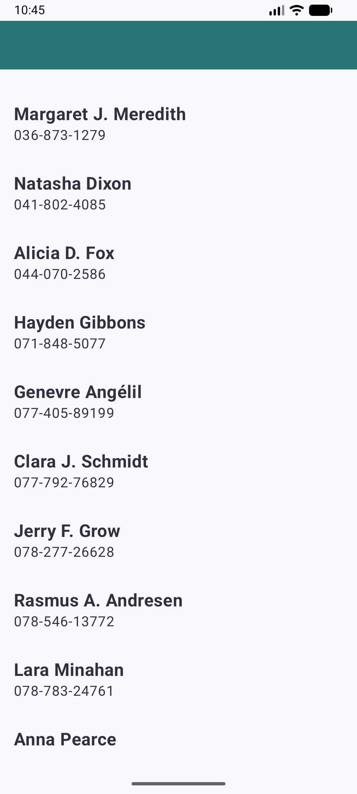
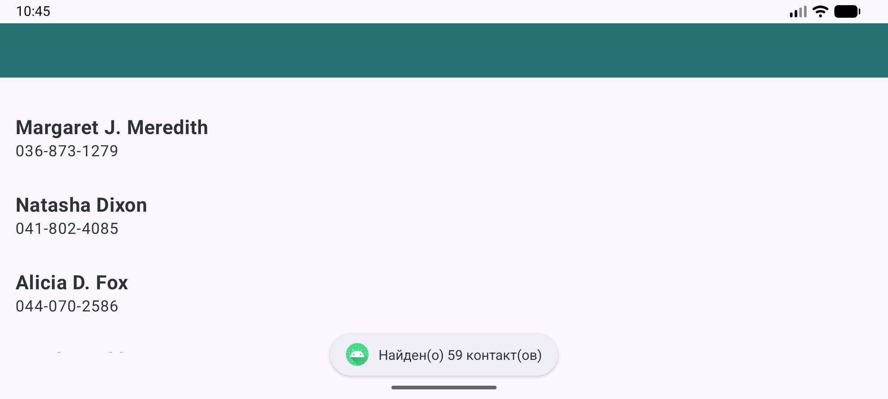

# Список контактов

Android-приложение на Kotlin и Jetpack Compose. Показывает список контактов с телефона.

## Возможности

- Запрашивает разрешение `READ_CONTACTS` при запуске
- Если разрешение есть, загружает контакты и показывает их в списке
- По нажатию на контакт открывает набор номера

## Запуск

1. Клонировать репозиторий:
   ```
   git clone https://github.com/CallistoCode443/contacts-list.git
   ```
2. Открыть проект в Android Studio
3. Запустить на эмуляторе или на телефоне, с помощью кнопки Run.

## Тестовые данные

В эмуляторе по умолчанию контактов нет. Чтобы было что показывать, использовался готовый набор данных [demo-contacts-for-Android](https://github.com/tausiq/demo-contacts-for-Android).

## Скриншоты



